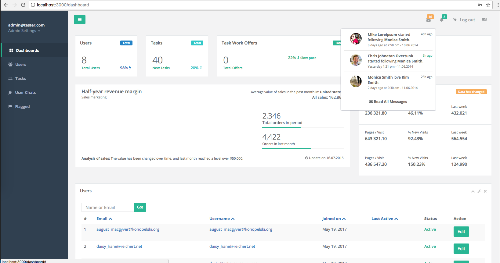
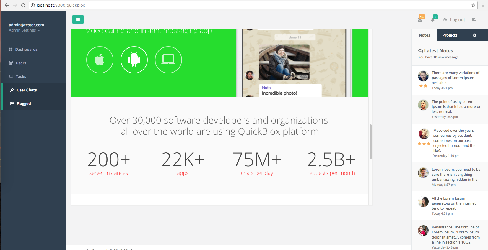

# Ruby on Rails Task management System App

## Screenshots
[]()
[]()

##Initial Setup
* create a config/database.yml file
* create a config/secrets.yml file
```
bundle install
rake db:create db:migrate db:seed
rails s
```

##Updating
```
git pull origin --BRANCH--
bundle install
rake db:migrate
rails s
```